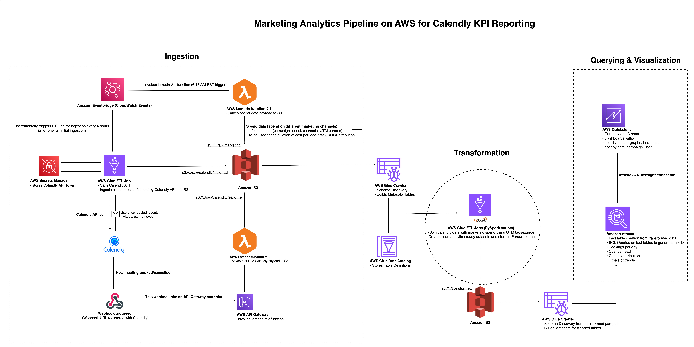

# Marketing Analytics Pipeline on AWS for Calendly KPI Reporting

This document describes a **serverless data‑engineering pipeline** built on AWS for ingesting Calendly event data and marketing spend, transforming it into clean analytics tables, and visualizing key performance indicators (KPIs). The goal is to help marketers understand how campaigns translate into meetings, what it costs to generate a lead and how resources are utilized across the organization. This pipeline combines historical batch processing with real‑time ingestion to deliver timely and comprehensive insights.

## Business Goal and Use‑Case

Modern marketing teams spend heavily across multiple channels (Facebook, YouTube, TikTok, etc.) and book customer appointments using Calendly. To optimize spend and scheduling, the team needs to answer questions such as:

* *Which channels generate the highest number of qualified leads and meetings?*

* *What is the cost per booking (CPB) for each campaign?*

* *How do bookings trend over time, and are there seasonal patterns?*

* *How is work distributed among employees, and are there imbalances?*

The primary objective of this project is to **construct a robust data‑engineering pipeline on AWS** that continuously ingests Calendly events and marketing spend, cleans and transforms that data, loads it into an analytics store, and calculates business metrics. By automating ingestion, transformation and reporting, the pipeline supports strategic decision making and improves operational efficiency.

## Architectural Overview

The solution follows a **Lambda Architecture** that combines batch processing for historical data with streaming for real‑time events. It uses fully managed AWS services—Lambda, Glue, S3, EventBridge, API Gateway, Athena, Secrets Manager and QuickSight—to minimise operational overhead and scale automatically. The high‑level design is shown below:

**Key components**

| Area | Purpose | AWS services |
| :---- | :---- | :---- |
| **Ingestion (Bronze layer)** | Capture raw marketing spend, historical scheduled events and real‑time Calendly webhook data into an S3 data lake. Maintain schema metadata via Glue Crawlers. | EventBridge, Lambda, API Gateway, AWS Secrets Manager, Glue job, S3, Glue Crawlers. |
| **Transformation (Silver layer)** | Use Glue ETL jobs (PySpark) to flatten nested JSON, compute meeting durations, deduplicate spend entries and standardize timestamps. Output analytics‑ready Parquet files. | AWS Glue ETL, S3 |
| **Analytics & Gold layer** | Create dimension and fact tables in Athena using SQL to join and enrich the silver datasets derive metrics and prepare for BI visualization. | AWS Glue Data Catalog, Athena |
| **Visualization** | Build interactive dashboards for marketers and leadership using QuickSight connected to Athena. Include time‑series charts, bar charts, heatmaps and leaderboards. | Amazon QuickSight |

## Data Ingestion Pipeline

### A. Marketing Spend Data

1. **Scheduled trigger via EventBridge** – A CloudWatch Events rule triggers the *marketing spend* Lambda (Lambda \#1) every morning at 06:15 AM EST.

2. **Lambda function** – The function (lambda1(marketing\_spend\_data).py) copies yesterday’s spend file spend\_data\_\<YYYY-MM-DD\>.json from a public S3 bucket into the project’s bucket under raw/calendly/marketing/. The destination key follows the structure raw/calendly/marketing/spend\_data\_YYYY-MM-DD.json. Configure two environment variables in Lambda: PUBLIC\_BUCKET (source) and DEST\_BUCKET (destination).

3. **Glue crawler** – After the marketing spend Lambda runs, run a Glue crawler (marketing-spend-crawler) over raw/calendly/marketing/ to build a table (marketing\_spend\_marketing) for downstream ETL.

### B. Historical Scheduled Events

1. **Glue ETL job** – The script glue\_calendly\_ingestion.py is run as an AWS Glue job. It uses AWS Secrets Manager to retrieve a **Calendly API token** and calls the /scheduled\_events endpoint to fetch full event objects. The job handles pagination, enriches each event with detail via follow‑up API calls, and writes each page to raw/calendly/historical/YYYY/MM/DD/page\_\<n\>.json in S3. A tracker file stored at metadata/calendly\_ingestion\_tracker.json records the timestamp of the last event ingested to support incremental loads.

2. **EventBridge scheduling** – Initially run once to backfill historical data; subsequently scheduled every four hours via EventBridge to ingest new events.

3. **Glue crawler** – After ingestion, run a Glue crawler (calendly-historical-crawler) on the raw/historical prefix to infer a schema and create a table (scheduled\_events\_historical) in the Glue Data Catalog.

### C. Real‑Time Calendly Webhooks

1. **API Gateway** – Create an HTTP API endpoint to receive webhooks from Calendly when a meeting is booked or cancelled. Register the endpoint as a webhook in your organization’s Calendly account.

2. **Lambda function** – The handler (lambda2(webhook\_real\_time).py) is triggered by API Gateway. It accepts POST events and writes the JSON payload into S3 under raw/calendly/real-time/YYYY/MM/DD/\<UUID\>.json. A GET request returns a simple health check (testing).

3. **Real‑time raw crawler** – Another Glue crawler (calendly-realtime-crawler) is pointed at raw/calendly/real-time/ to create a table (webhook\_invitee\_events\_real\_time) containing the raw webhook payloads.

## Data Transformation (Silver Layer)

Raw JSON data must be flattened, cleaned and deduplicated before analysis. Three Glue PySpark jobs perform these transformations:

1. **Marketing Spend ETL** – The script marketing\_spend\_etl.py reads the raw spend table from the Data Catalog. It casts the date to a proper DATE, deduplicates by (date, channel) keeping the most recent entry using a window function, and writes Parquet output to transformed/marketing\_spend/. A crawler (crawl-transformed-spend-data) catalogues the Parquet files as a clean\_marketing\_spend table.

2. **Scheduled Events Historical ETL** – scheduled\_events\_historical\_etl.py flattens nested JSON arrays in the scheduled events data using explode, extracts attributes such as event\_name, start\_time, end\_time, duration\_minutes, event\_type\_uri, organizer\_name and writes Parquet to transformed/scheduled\_events/. A crawler (crawl-transformed-scheduled-event)catalogs this as clean\_scheduled\_events.

3. **Webhook Invitee Events ETL** – webhook\_invitee\_events\_etl.py processes the real‑time webhook payloads. It renames nested fields (invitee email, name, status, timestamps) and event metadata, converts timestamps using to\_timestamp, and writes Parquet to transformed/webhook\_invitee\_events/. A crawler (crawl-transformed-webhook-events-realtime) builds the clean\_webhook\_invitee\_events table.

## Gold Layer: Athena Fact and Dimension Tables

After the Silver layer is ready, Athena is used to create **dimension** and **fact** tables that enable SQL analytics. The queries should be executed in Athena and the results written back to S3 in fact/ and dim/ directories.

### Dimension Table

* event\_type\_dim – A small mapping table that associates Calendly event\_type URIs to marketing channels (Facebook, YouTube, TikTok). This simplifies channel attribution in the fact tables.

### Fact Tables

* **scheduled\_events\_fact** – Derived from the clean\_scheduled\_events dataset. Cast string timestamps to proper TIMESTAMP/DATE types, filter for active events with non‑null channels, join to event\_type\_dim to include channel and campaign attributes, and write the results to an S3 fact directory (partitioned by ingestion\_date) for efficient querying[\[4\]](file:///home/oai/share/calendly_pipeline_doc.txt).

* **webhook\_invitee\_fact** – Built from clean\_webhook\_invitee\_events. Select key invitee fields (identifiers, names, emails, timestamps) and rename them. Derive a real\_time\_ingestion\_timestamp and join to event\_type\_dim to add channel context. Partition by ingestion\_date and store in Parquet format[\[4\]](file:///home/oai/share/calendly_pipeline_doc.txt).

* **marketing\_spend\_fact** – Cast the raw spend values to DECIMAL, truncate dates to a daily granularity and write out to Parquet. Partition by spend\_date[\[4\]](file:///home/oai/share/calendly_pipeline_doc.txt).

Run a Glue crawler over each fact directory to create Athena tables (e.g., scheduled\_events\_fact, webhook\_invitee\_fact, marketing\_spend\_fact).

### Business Metrics and Queries

Once the fact tables are available, several important metrics can be computed using Athena SQL queries, including but not limited to the following:

* **Daily calls booked by source** – Count of bookings per channel per day.

* **Cost per booking (CPB)** – Divide marketing spend by number of bookings for each channel.

* **Booking trends over time** – Rolling sums or moving averages to highlight seasonality.

* **Channel attribution** – ROI analysis using spend and booking metrics.

* **Booking volume by time slot/day** – Heatmaps to assist resource planning.

* **Employee meeting load** – Aggregations by organiser to identify workload imbalances.

These queries can be saved in Athena workgroups or defined as views for QuickSight.

## Visualization: QuickSight Dashboards

Connect Amazon QuickSight to Athena by creating a new data source. Import the fact and dimension tables and build interactive dashboards. QuickSight supports line and area charts for booking trends, bar charts for spend vs bookings, heatmaps for time slot patterns, and leaderboards for employee workload. The dashboard PDF provided demonstrates examples of these visuals: daily bookings per channel, weekly trends, total spend, total booked calls and cost per booking. You can replicate similar visuals by dragging fields onto the canvas and applying filters by date, channel, campaign or employee.

## Step‑by‑Step Deployment Guide

Follow these steps to replicate the entire pipeline in your own AWS account. Where appropriate, substitute your own bucket names and region.

1. **Create an S3 bucket** (e.g., calendly-marketing-data) with sub‑prefixes: raw/calendly/historical/, raw/calendly/real-time/, raw/calendly/marketing/, transformed/, fact/, dim/ and metadata/.

2. **Store the Calendly API token** in AWS Secrets Manager under a secret name such as calendly-api-token. The JSON should contain a key CalendlyAPIToken with your personal token.

3. **Deploy Lambda \#1 (marketing spend)**:

4. Upload lambda1(marketing\_spend\_data).py as a Lambda function.

5. Set environment variables PUBLIC\_BUCKET and DEST\_BUCKET.

6. Assign an IAM role granting read access to the public bucket and write access to your project bucket.

7. Create a CloudWatch Events (EventBridge) rule to trigger this function at 06:15 AM every day. Configure the schedule expression (e.g., cron(15 6 ? \* \* \*)).

8. **Deploy Lambda \#2 (real‑time webhook ingestion)**:

9. Upload lambda2(webhook\_real\_time).py.

10. Create an HTTP API in API Gateway and integrate it with the Lambda via a Lambda proxy integration.

11. Note the invoke URL and configure a webhook in Calendly (developer settings → Integrations) pointing to this URL. Ensure it listens to invitee.created and invitee.canceled events.

12. Set up the IAM role with permission to write to your S3 bucket.

13. **Create the historical ingestion Glue job**:

14. Go to AWS Glue and create a Python shell job using the script glue\_calendly\_ingestion.py.

15. Assign an IAM role with S3 write permissions and Secrets Manager read permission.

16. During the first run, set the job to ingest all historical data. Afterwards, schedule the job via EventBridge to run every 4 hours.

17. **Create the three Glue ETL jobs** for transformation (marketing spend, scheduled events historical, webhook invitee events) using the provided PySpark scripts. Configure each to read from the raw tables and write to the appropriate transformed/ prefix in your bucket.

18. **Set up Glue Crawlers**:

19. One crawler for each raw area (calendly-historical-crawler, calendly-realtime-crawler, marketing-spend-crawler) targeting the raw prefixes; assign them to a Glue database (e.g., calendly\_project\_db).

20. One crawler for each transformed dataset to create silver tables.

21. One crawler for each fact table after you run the Athena queries.

22. **Create the Athena database and tables**:

23. In the Athena console, create a database (e.g., calendly\_analytics\_db).

24. Use SQL to create the dimension and fact tables described above, pointing to the Parquet files in your bucket. Save the queries for future updates.

25. **Compute metrics** by executing the metric queries in Athena or define them as views.

26. **Build QuickSight dashboard(s)**:

27. In QuickSight, create a new dataset by connecting to the Athena database.

28. Use the imported tables to build visualisations: line charts for booking trends, bar charts for cost and bookings, heatmaps for time‑slot patterns, etc.

29. Share dashboards with stakeholders to track marketing KPIs.

## Conclusion

By following this guide one can reproduce a **production‑ready marketing analytics pipeline** for Calendly events. The design leverages AWS serverless services to ingest both historical and real‑time data, process it with scalable ETL jobs, store clean datasets in an S3‑based lake house, and expose insights through Athena and QuickSight. This architecture provides a single source of truth for marketing KPIs—ranging from bookings and cost per booking to workload metrics—enabling data‑driven decision making and improved campaign performance.

---
